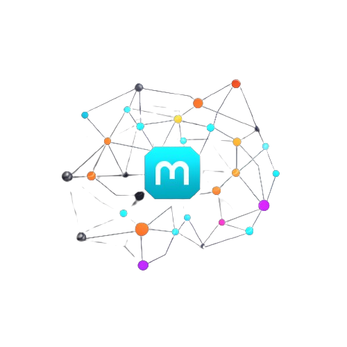

[![Contributors][contributors-shield]][contributors-url]
[![Issues][issues-shield]][issues-url]
[![MIT License][license-shield]][license-url]
[![LinkedIn][linkedin-shield]][linkedin-url]

<!-- PROJECT LOGO -->
<br />
<div align="center">
  <a href="https://github.com/yuriykis/microblocknet">
    
  </a>

<h3 align="center">MicroBlockNet</h3>

  <p align="center">
    Distributed blockchain application 
    <br />
    <a href="https://github.com/yuriykis/microblocknet/issues">Report Bug</a>
    ·
    <a href="https://github.com/yuriykis/microblocknet/issues">Request Feature</a>
  </p>
</div>


## Important Note
This project is currently under development. It is not ready for production or even testing. Please check back later for updates.

## About The Project
MicroBlockNet is a distributed blockchain application consisting of multiple nodes that interconnect in real-time. It is built to ensure redundancy, as nodes periodically attempt to reconnect to unresponsive nodes. If unsuccessful after several attempts, the unresponsive node will be removed from memory.

## Features
* Distributed Nodes: Allows for a highly available network of blockchain nodes.
* Self-Healing: Nodes constantly monitor the network, attempting to reconnect with any unresponsive peers. If a node remains unresponsive, it will be removed from the active network.
* Docker Integration: Easily set up your blockchain nodes with Docker.
* Makefile: A Makefile is provided to simplify the process of building and running the application.
* Monitoring: A monitoring created based on Prometheus and Grafana is provided to monitor the health of the network.
* Consul: Consul is used to provide service discovery and health checks for the nodes.
* Kafka: Kafka is used to provide a distributed message queue for communication between nodes and the gateway. The nodes register themselves in gateway and send messages to Kafka.

## Prerequisites
Before you begin, ensure you have the following installed:
* Docker
* Docker Compose

## Getting Started

1. Clone the repo
   ```sh
   git clone https://github.com/yuriykis/microblocknet.git
   cd microblocknet
    ```
2. Run the Application
If you simply want to run the application:
   ```sh
   make gate
   make kafka
   make node
   ```
You can also test the application client by running the following command:
   ```sh
   make client
   ```
The client will return the new transaction.
3. You can use Docker Compose to run the application in the background:
   ```sh
   make up
   ```
This will build the necessary Docker images and start the Docker Compose setup. Once started, your blockchain nodes will be running in Docker containers.

## Architecture
MicroBlockNet is designed to be robust and fault-tolerant. The nodes in the system are constantly monitoring the network, ensuring that information is consistent across all active participants. Any node that becomes unresponsive is temporarily quarantined and attempts are made to reconnect. If these attempts fail over a predetermined period, the node is removed from the active roster, ensuring that the network remains healthy.

## Contributing
If you would like to contribute to MicroBlockNet, please fork the repository and create a pull request. You can also create an issue if you have any questions or suggestions.

## License
Distributed under the MIT License. See `LICENSE` for more information.


<!-- MARKDOWN LINKS & IMAGES -->
<!-- https://www.markdownguide.org/basic-syntax/#reference-style-links -->
[contributors-shield]: https://img.shields.io/github/contributors/yuriykis/bluetooth-keepalive.svg?style=for-the-badge
[contributors-url]: https://github.com/yuriykis/bluetooth-keepalive/graphs/contributors
[issues-shield]: https://img.shields.io/github/issues/yuriykis/bluetooth-keepalive.svg?style=for-the-badge
[issues-url]: https://github.com/yuriykis/bluetooth-keepalive/issues
[license-shield]: https://img.shields.io/github/license/yuriykis/bluetooth-keepalive.svg?style=for-the-badge
[license-url]: https://github.com/yuriykis/bluetooth-keepalive/blob/master/LICENSE.txt
[linkedin-shield]: https://img.shields.io/badge/-LinkedIn-black.svg?style=for-the-badge&logo=linkedin&colorB=555
[linkedin-url]: https://linkedin.com/in/yuriy-kis